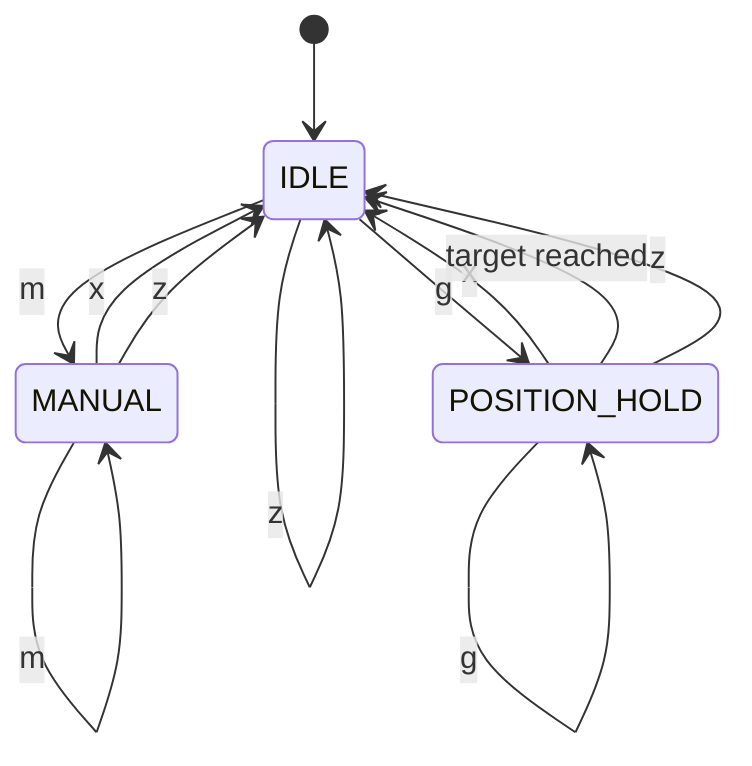
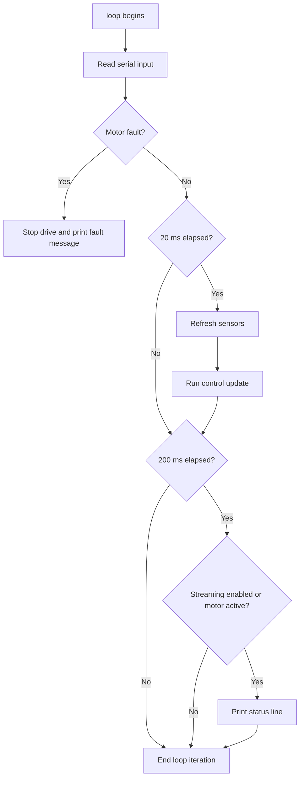
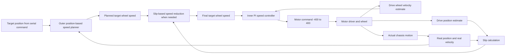

# Drive Control System Explanation

This document explains the control system currently implemented in `src_mega/drive_and_control_test.cpp`.

It is written for readers who may not have access to the source code. The goal is to describe, in plain language, what the program does, what hardware it expects, how it measures motion, how it decides what motor command to send, and how an operator interacts with it over serial.

## 1. What This Program Is

This program is a test and development controller for the Mega-based drive system.

Its job is to move a chassis or carriage along a rail to a requested position. It does that using:

- one drive motor connected through a Pololu Dual G2 high-power motor shield
- one quadrature encoder on the drive motor
- one AS5600 magnetic encoder used as an independent "real position" measurement
- a serial command interface for commanding moves and tuning parameters

The controller is not just "set a motor speed and hope." It is a layered feedback controller:

- the outer layer decides how fast the wheel should be moving based on how far the chassis still is from the target
- the inner layer decides what motor command is needed to make the wheel actually move at that requested speed
- an additional slip monitor compares wheel-estimated travel against independently measured rail travel and slows the system down if those two begin to disagree too much

In short, this program tries to answer three questions repeatedly:

1. Where is the chassis really located?
2. How fast should it be moving right now to approach the target cleanly?
3. What motor command will make the drive wheel produce that motion?

## 2. Hardware Connections and Signals

The implemented controller assumes the following hardware structure:

| Item | Purpose | Implemented details |
| --- | --- | --- |
| Arduino Mega | Main controller | Runs the program and serial interface |
| Pololu motor shield | Drives the motor | Uses motor channel `M1` |
| Drive motor quadrature encoder | Measures motor and wheel rotation | Connected to pins `19` and `18` |
| TCA9548A-style I2C multiplexer | Selects I2C device path | I2C address `0x70` |
| AS5600 magnetic encoder | Measures independent physical position | I2C address `0x36`, mux channel `5` |

The motor direction can optionally be flipped in software through the `FLIP_DRIVE_MOTOR` flag. In the current implementation that flag is `false`, so no reversal is applied by default.

## 3. Why There Are Two Position Measurements

The controller keeps track of motion in two different ways.

### 3.1 Drive encoder position

The drive encoder is attached to the drive motor. It tells the program how much the motor shaft has rotated. Using the known gear ratio and wheel radius, the code converts encoder counts into estimated linear travel.

This measurement is useful because it is directly connected to the thing being actuated: the drive wheel.

### 3.2 Real position encoder

The AS5600 sensor is used as an independent position measurement. The code treats this as the "real" travel of the chassis along the rail.

This measurement is important because wheel rotation does not always equal actual chassis motion. If the wheel slips, the drive encoder may report movement that did not really happen on the rail.

### 3.3 Slip estimate

The code defines slip as:

```text
slip distance = drive-estimated position - real measured position
```

If this value grows too large, the controller assumes the drive wheel is getting ahead of the chassis and temporarily reduces the requested wheel speed.

This is a simple but effective way to detect traction problems without needing a more advanced estimator.

## 4. Coordinate System and Zeroing

This program does not establish an absolute world coordinate by homing to a fixed reference switch.

Instead, when the program starts, or whenever the operator sends the `z` command, the current physical location becomes the new zero point.

The zeroing behavior is:

- the motor command is set to zero
- the drive encoder count is reset to zero
- the accumulated AS5600 travel count is reset to zero
- the current raw AS5600 angle is saved as the new starting reference
- all controller state is cleared

The result is:

- current rail position becomes `0.0 in`
- current wheel position estimate becomes `0.0 in`
- all future targets are interpreted relative to that new zero

So if the operator sends `g 24`, the program will try to move to a position 24 inches away from wherever the system was last zeroed.

## 5. Unit Conversions

The implementation works mostly in inches and inches per second.

### 5.1 Drive encoder to linear distance

The code uses:

- `1200` counts per motor revolution
- gear ratio `0.5`
- drive wheel radius `0.6 in`

The conversion is:

```text
wheel revolutions = encoder counts / (gear ratio * counts per motor revolution)
drive distance (in) = wheel revolutions * (2 * pi * wheel radius)
```

With the current constants, each encoder count corresponds to a small fraction of an inch of estimated wheel travel.

### 5.2 AS5600 to linear distance

The code uses:

- `4096` counts per revolution from the AS5600
- real-position wheel diameter `0.875 in`

The conversion is:

```text
real distance (in) = (total AS5600 counts / 4096) * (pi * wheel diameter)
```

### 5.3 Velocity calculation

Neither sensor provides velocity directly. The program estimates velocity by taking the change in position divided by elapsed time:

```text
velocity = (current position - previous position) / dt
```

This is done separately for:

- drive-estimated velocity
- real measured velocity

## 6. How the Real Position Sensor Is Read Reliably

The AS5600 is a 12-bit angle sensor, so its raw reading wraps from `4095` back to `0` once per revolution.

If the code simply subtracted consecutive raw readings, that wraparound would look like a huge backward jump. To avoid that, the program unwraps the reading:

- if the raw delta is greater than half a revolution, it subtracts `4096`
- if the raw delta is less than negative half a revolution, it adds `4096`

That converts the wrapped angle into a continuous count that can increase or decrease across many revolutions.

The code also ignores extremely small changes smaller than the configured noise threshold. In the current implementation that threshold is `1` count, which means almost every real change is accepted.

If the AS5600 read fails, the code does not stop the system immediately. It simply keeps the previously accumulated real-position count and continues.

## 7. Control Modes

The controller has three modes.

| Mode | Meaning | Behavior |
| --- | --- | --- |
| `MODE_IDLE` | Stopped | Motor command is forced to zero |
| `MODE_MANUAL` | Direct operator control | The entered motor command is applied directly |
| `MODE_POSITION_HOLD` | Closed-loop move-to-position mode | The controller computes a target wheel speed and a motor command automatically |

### State Diagram



Important detail:

- `MODE_MANUAL` bypasses the closed-loop position controller
- `MODE_POSITION_HOLD` is the only mode where the automatic motion logic is active
- despite the name `MODE_POSITION_HOLD`, the code does not actively hold position forever; once the target is reached and settled, it stops the motor and returns to `MODE_IDLE`

## 8. Main Program Cycle

The `loop()` function runs continuously, but the control logic itself is executed on a timed schedule.

### 8.1 Every pass through `loop()`

The program does these things in order:

1. Read and process any serial input.
2. Check the motor shield fault flag.
3. If at least 20 ms have passed, refresh sensor values and update the controller.
4. If at least 200 ms have passed, print a status line when streaming is enabled.

### 8.2 Timing

The key timing values are:

- control update interval: `20 ms`
- status print interval: `200 ms`
- target settle time required before declaring success: `250 ms`

Although a constant named `CONTROL_INTERVAL_S` exists, the actual controller uses measured elapsed time from `millis()` for its `dt`, not a hard-coded fixed 0.02 s value.

### Main Loop Flowchart



## 9. Sensor Refresh Step

Every control update, the code performs the following sensing sequence:

1. Read the AS5600 angle through the I2C multiplexer.
2. Update the accumulated real-position count with wrap handling.
3. Copy the previous snapshot of state.
4. Recompute current drive position in inches.
5. Recompute current real position in inches.
6. Estimate drive and real velocities using finite difference over `dt`.

The program stores the current and previous sensor snapshot in a structure containing:

- drive position
- real position
- drive velocity
- real velocity

That snapshot is the data source for the rest of the controller.

## 10. Overall Control Architecture

The control system is layered.

### High-level description



There are really two controllers working together:

- an outer motion-profile generator that decides what wheel speed should be requested
- an inner PI velocity loop that turns that requested wheel speed into a motor command

## 11. Outer Layer: Position-Based Speed Planning

The outer layer begins with position error:

```text
position error = target position - real measured position
```

This is important: the outer loop uses the independent real-position sensor, not the drive wheel estimate, as its primary position reference.

### 11.1 Immediate stop near the target

If the absolute position error is already within the target tolerance, the requested speed becomes zero immediately.

Current tolerance:

- `0.15 in`

### 11.2 Cruise-speed limit

The requested cruise speed is limited to:

- operator-selected steady cruise speed
- capped at `24 in/s` maximum

The default cruise setting is:

- `12 in/s`, which is `1 ft/s`

### 11.3 Braking-speed limit

The controller computes how fast it can be moving and still stop within the remaining distance, using:

```text
braking speed = sqrt(2 * deceleration * remaining distance)
```

This is a standard constant-deceleration stopping relation.

The actual desired speed is then:

```text
desired speed = min(cruise speed, braking speed)
```

This means:

- when far from the target, the system tries to run at cruise speed
- when close enough that cruise would overshoot, the braking-speed formula takes over and automatically reduces the request

### 11.4 Final approach window

Inside the final-approach window, the desired speed is further limited to a smaller low-speed value.

Current defaults:

- final approach window: `2.0 in`
- final approach speed: `2.0 in/s`

This gives the controller a gentler last few inches of travel.

### 11.5 Direction handling

After the speed magnitude is selected, the sign is assigned from the position error:

- positive error means drive in the positive direction
- negative error means drive in the negative direction

### 11.6 Damping during final approach

Inside the final-approach window, the controller subtracts a damping term based on measured real velocity:

```text
desired speed = desired speed - (stop damping gain * real velocity)
```

Current default damping gain:

- `0.35`

This is meant to soften the stop and reduce oscillation or excitation near the target.

### 11.7 Acceleration limiting

The controller does not jump the target wheel speed instantly to the newly desired value.

Instead, it rate-limits the change:

```text
max speed change per update = ramp-up acceleration * dt
```

The requested speed can only change by that amount each cycle. This creates a ramp-up behavior and helps reduce startup slip.

Current default acceleration limit:

- `18 in/s^2`

## 12. Slip Monitoring and Response

The code continuously computes:

```text
slip = drive position - real position
```

It uses two thresholds.

### 12.1 Warning threshold

If:

```text
abs(slip) >= 0.75 in
```

the status output includes the label `SLIP`.

This does not directly change control behavior. It is only an operator warning.

### 12.2 Slowdown threshold

If:

```text
abs(slip) >= 1.50 in
```

the target wheel speed is multiplied by the slowdown scale:

```text
target wheel speed = target wheel speed * 0.55
```

So once large slip is detected, the controller requests only 55% of the normal speed until the slip condition improves.

This is a simple protective behavior. It is not a full traction controller and does not estimate friction or actively correct slip direction.

## 13. Inner Layer: PI Wheel-Speed Control

Once the outer layer has produced a target wheel speed, the inner loop tries to make the drive wheel match it.

The inner loop uses the drive encoder, not the AS5600, because the motor command directly affects wheel rotation.

### 13.1 Velocity error

The velocity error is:

```text
velocity error = target wheel speed - measured drive wheel speed
```

### 13.2 Proportional term

The proportional contribution is:

```text
P contribution = kVelP * velocity error
```

Current default:

- `kVelP = 24.0`

### 13.3 Integral term

The integral contribution accumulates velocity error over time:

```text
integral = integral + velocity error * dt
I contribution = kVelI * integral
```

Current defaults:

- `kVelI = 10.0`
- integral clamp limit = `250`

The integral is clamped so it cannot grow without bound.

### 13.4 Special handling near the target

When the system is inside the final-approach window, the code does not continue integrating error normally.

Instead, it reduces the stored integral by multiplying it by `0.85` each update.

This has the effect of bleeding off integral action near the stop, which reduces the risk of overshoot caused by stored control effort.

### 13.5 Integral reset at very low requested speed

If the target wheel speed magnitude falls below `0.05 in/s`, the integral term is reset to zero.

This prevents stale integral buildup from continuing to push the motor when the target is effectively zero speed.

### 13.6 Final motor command

The motor command is computed as:

```text
motor command = (kVelP * velocity error) + (kVelI * integral)
```

The result is rounded to an integer and then clamped to the motor driver's valid range:

- minimum `-400`
- maximum `400`

That final command is sent to motor channel `M1`.

## 14. How the Program Decides a Move Is Finished

The controller does not stop the instant it crosses the target.

Instead, it requires the system to stay inside a settle window for a short time.

### 14.1 Settle conditions

The move is considered "in the settle window" only if both are true:

- absolute position error is at most `0.15 in`
- absolute real velocity is at most `0.20 in/s`

This means the carriage must be both close enough and slow enough.

### 14.2 Settle timer

If those conditions are met:

- the first qualifying moment starts a timer
- if the conditions remain true for `250 ms`, the target is declared reached

If the conditions break before the timer expires, the timer is reset and the controller keeps working.

### 14.3 What happens when the target is reached

When the settle timer completes:

- the controller calls `stopDrive()`
- the mode returns to `MODE_IDLE`
- the motor command becomes zero
- the velocity integrator is cleared
- the serial port prints `Target reached.`

This is a deliberate debounce against brief crossings or noisy measurements.

## 15. Manual Mode

Manual mode is entered with:

```text
m <cmd>
```

Examples:

- `m 150`
- `m -80`

In this mode:

- the command is clamped to the range `-400` to `400`
- that command is sent directly to the motor
- the automatic position controller is bypassed
- the velocity integrator is cleared when manual mode is entered

Manual mode is useful for checking hardware behavior or moving the system without the position loop.

## 16. Serial Command Interface

The serial interface runs at `115200 baud`.

Commands are line-based:

- characters are buffered until newline
- carriage return is ignored
- each completed line is tokenized by spaces and processed

### Operator commands

| Command | Meaning |
| --- | --- |
| `h` | Print help text |
| `z` | Stop motion and zero both position measurements at the current location |
| `x` | Stop the motor and leave control mode |
| `p` | Print one status line |
| `stream` | Toggle periodic status streaming |
| `stream on` | Force periodic status printing on |
| `stream off` | Return to automatic printing behavior |
| `m <cmd>` | Apply a direct motor command from `-400` to `400` |
| `g <inches>` | Move to the requested rail position in inches |
| `ss <ft/s>` | Set steady cruise speed in feet per second, limited to 2 ft/s |
| `accel <in/s^2>` | Set ramp-up acceleration limit |
| `decel <in/s^2>` | Set braking deceleration used in the speed profile |
| `approach <window_in> <speed_in_s>` | Set final-approach window and speed |
| `damp <gain>` | Set damping gain used near the target |
| `kvp <value>` | Set velocity-loop proportional gain |
| `kvi <value>` | Set velocity-loop integral gain |
| `slip <warn> <slow>` | Set slip warning and slowdown thresholds |

### Example operator sequence

An example session might look like this:

```text
z
ss 1.0
accel 18
decel 20
approach 2.0 2.0
g 24
```

That sequence means:

1. declare the current location to be zero
2. set cruise speed to 1 ft/s
3. use 18 in/s^2 for acceleration limiting
4. use 20 in/s^2 to compute braking speed
5. use a 2-inch final approach window at 2 in/s
6. command a move to +24 inches

## 17. Status Output

The program can print periodic status every 200 ms.

By default, status is printed automatically only while the motor command is nonzero. The operator can also force continuous printing with `stream on`.

The status line includes:

- mode number
- applied motor command
- target position
- cruise setting
- acceleration setting
- final-approach window and speed
- real position
- drive-estimated position
- real velocity
- drive-estimated velocity
- target wheel speed
- slip estimate

It may also append flags:

- `SETTLING` when the system is inside the settle window
- `SLIP` when the warning slip threshold has been exceeded

## 18. Default Tuning Values in the Current Implementation

| Parameter | Default value | Role |
| --- | --- | --- |
| `steadyCruiseSpeedInPerS` | `12.0 in/s` | Normal cruising speed |
| `rampUpAccelInPerS2` | `18.0 in/s^2` | Limits how quickly requested speed can rise |
| `slowdownDecelInPerS2` | `20.0 in/s^2` | Determines braking-speed limit |
| `finalApproachWindowIn` | `2.0 in` | Distance from target where extra-slow approach begins |
| `finalApproachSpeedInPerS` | `2.0 in/s` | Max speed allowed during final approach |
| `stopDampingGain` | `0.35` | Uses measured real velocity to soften final stop |
| `kVelP` | `24.0` | Proportional velocity gain |
| `kVelI` | `10.0` | Integral velocity gain |
| `velIntegralLimit` | `250.0` | Anti-windup limit for integral storage |
| `slipWarnThresholdIn` | `0.75 in` | Adds `SLIP` warning to status |
| `slipSlowThresholdIn` | `1.50 in` | Triggers automatic speed reduction |
| `slipSlowScale` | `0.55` | Keeps only 55% of requested speed under heavy slip |
| `TARGET_TOLERANCE_IN` | `0.15 in` | Position threshold for success |
| `STOP_VELOCITY_TOLERANCE_IN_S` | `0.20 in/s` | Velocity threshold for success |
| `TARGET_SETTLE_TIME_MS` | `250 ms` | Time conditions must remain true |

## 19. What Happens During a Typical Closed-Loop Move

If the operator enters `g 24`, the sequence is:

1. The controller enters `MODE_POSITION_HOLD` and stores the target position `24 in`.
2. Every 20 ms it updates both sensors and computes the real position error.
3. The outer layer determines how fast the wheel should be moving:
   far away it allows cruise speed, closer in it limits speed according to braking distance, and in the final 2 inches it limits speed further to a low approach value.
4. The slip monitor checks whether wheel-estimated travel is getting too far ahead of actual travel and, if necessary, reduces the requested speed.
5. The inner PI loop compares requested wheel speed to measured wheel speed and generates a motor command.
6. As the carriage nears the target, damping and reduced integral action help soften the stop.
7. Once the carriage is both close enough and slow enough for 250 ms, the program stops the motor and returns to idle.

## 20. Important Characteristics and Limitations of the Implemented Design

This section is not a criticism. It is simply a clear statement of what the current code does and does not do.

### Implemented characteristics

- It is a two-layer feedback controller, not a single PID directly on position.
- Position decisions are based on the independent real-position sensor.
- Motor actuation is based on a PI loop around drive-wheel speed.
- Slip handling is based on disagreement between two position estimates.
- Move completion requires both position and low velocity for a sustained time.

### Not currently implemented

- no derivative term in the inner velocity loop
- no absolute homing switch in this file
- no automatic fault handling for failed AS5600 reads beyond keeping the last valid position
- no model-based estimator or feedforward term
- no closed-loop correction in manual mode
- no explicit jerk-limited trajectory generator; the profile is based on cruise limit, braking-speed limit, and acceleration-limited speed changes

## 21. Short Summary

The implemented control system is a practical layered motion controller for moving a rail-mounted chassis to a target position.

It uses:

- the AS5600 path as the trusted position reference
- the drive encoder as the fast wheel-speed feedback source
- a motion profile to choose an appropriate requested speed
- a PI loop to convert that requested speed into motor command
- slip monitoring to reduce speed when wheel motion and actual motion disagree

That combination gives the system smoother starts, controlled cruising, gentler final approach, and a more reliable stop than a direct open-loop motor command.
